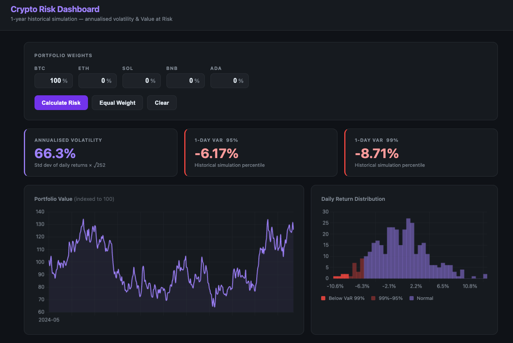

# Crypto Risk Dashboard

A lightweight Flask app for visualising portfolio risk metrics across a basket of cryptocurrencies.



---

## Features

- **Annualised Volatility** — standard deviation of daily returns scaled to a full year (σ × √252)
- **Value at Risk (95% & 99%)** — 1-day loss threshold via historical simulation
- **Portfolio value chart** — cumulative return indexed to 100 over a 1-year lookback
- **Return distribution histogram** — daily returns coloured by tail-risk zone (below VaR 99%, between 99–95%, normal)
- **Five assets** — BTC, ETH, SOL, BNB, ADA with freely adjustable weights
- Auto-normalises weights that don't sum to 100%
- Equal-weight and clear shortcuts

---

## Getting Started

**1. Clone the repo**

```bash
git clone <repo-url>
cd risk-dashboard-main
```

**2. Create a virtual environment and install dependencies**

```bash
python3 -m venv venv
source venv/bin/activate      # Windows: venv\Scripts\activate
pip install -r requirements.txt
```

**3. Run the app**

```bash
python app.py
```

Open [http://localhost:5000](http://localhost:5000) in your browser.

---

## Usage

1. Enter a percentage weight for each asset you want to hold (they don't need to sum to 100 — the app normalises automatically).
2. Click **Calculate Risk** to compute metrics and render charts.
3. Use **Equal Weight** to split evenly across all five assets, or **Clear** to reset.

The diversification effect is immediately visible: a single-asset BTC portfolio shows ~66% annualised volatility, while an equal-weight five-asset portfolio drops to ~40%.

---

## Project Structure

```
risk-dashboard-main/
├── app.py               # Flask backend — price generation & risk calculations
├── requirements.txt
├── templates/
│   └── index.html       # Dashboard UI (Jinja2 template)
└── static/
    ├── style.css        # Dark theme
    ├── app.js           # Chart.js charts + fetch calls
    └── preview.png      # Dashboard screenshot
```

---

## How It Works

### Mock price data

Prices are generated once at startup using **Geometric Brownian Motion** with a fixed seed (fully reproducible, no internet required):

```
S(t+1) = S(t) × exp((μ - ½σ²)Δt + σ√Δt × ε)
```

| Asset | Annual drift (μ) | Annual volatility (σ) |
|-------|-----------------|----------------------|
| BTC   | 50%             | 70%                  |
| ETH   | 60%             | 85%                  |
| SOL   | 80%             | 120%                 |
| BNB   | 40%             | 80%                  |
| ADA   | 30%             | 90%                  |

### Risk calculations

Given portfolio weights **w** and daily returns matrix **R**:

- **Portfolio daily return:** `r_p = R · w`
- **Annualised volatility:** `σ_p × √252`
- **1-Day VaR (95%):** 5th percentile of `r_p` (historical simulation)
- **1-Day VaR (99%):** 1st percentile of `r_p` (historical simulation)

---

## Stack

| Layer    | Technology              |
|----------|-------------------------|
| Backend  | Python 3, Flask         |
| Numerics | NumPy, Pandas           |
| Frontend | Vanilla JS, Chart.js 4  |
| Styling  | Plain CSS (dark theme)  |

No build step, no JS framework, no API keys required.

---

## Dependencies

```
flask
numpy
pandas
```
